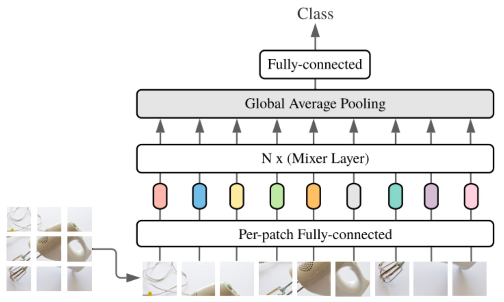

# Сегментация сосудов глаза с помощью гибридной архитектуры MLP-Mixer+Unet (UMixer)

## Задача

В рамках работы была протестирвана гибридная архитектра, объединяющая MLP-Mixer и UNet, для решения задачи сегментации сосудов глаза на трех медицинских датасетах: DRIVE, HRF, CHASEDB. 



## Структура репозитория

- train_model.py - главный скрипт тренировки модели, который поддерживает тренировку не только представленной в работе архитектуры, но и других страндарных архитектур: UNet, UNetPlusPlus и SAUNet. При дополнительной доработки можно добавить любую модель из segmentation_models_pytorch, а также свои собственные, которые можно добавлять в директорию models
- inference.py - код инференса на тестовом датасете для подсчета метрик и получения визуализации
- Все лоссы и метрики реализованы в utils, чтение и подготовка датасета в data
- В experiments представлен ноутбук с различными экспериментами

### Запуск тренировки

Запуск тренировки UMix на датасете DRIVE:

```
python train_model.py --model umix \
--model_name umix_drive --image_folder drive_dataset \
--save_dir umix_drive_results --lr 0.0002 \
--epoch 100 --batch_size 8
```

## Результаты

Презентация проекта (на русском языке): \
Отчет проекта (на русском языке): 

## Используемые источники

```
MLP-Mixer paper:
@article{tolstikhin2021mlp,
  title={Mlp-mixer: An all-mlp architecture for vision},
  author={Tolstikhin, Ilya O and Houlsby, Neil and Kolesnikov, Alexander and Beyer, Lucas and Zhai, Xiaohua and Unterthiner, Thomas and Yung, Jessica and Steiner, Andreas and Keysers, Daniel and Uszkoreit, Jakob and others},
  journal={Advances in neural information processing systems},
  volume={34},
  pages={24261--24272},
  year={2021}
}

SA-UNet
@inproceedings{guo2021sa,
  title={Sa-unet: Spatial attention u-net for retinal vessel segmentation},
  author={Guo, Changlu and Szemenyei, M{\'a}rton and Yi, Yugen and Wang, Wenle and Chen, Buer and Fan, Changqi},
  booktitle={2020 25th international conference on pattern recognition (ICPR)},
  pages={1236--1242},
  year={2021},
  organization={IEEE}
}
```
